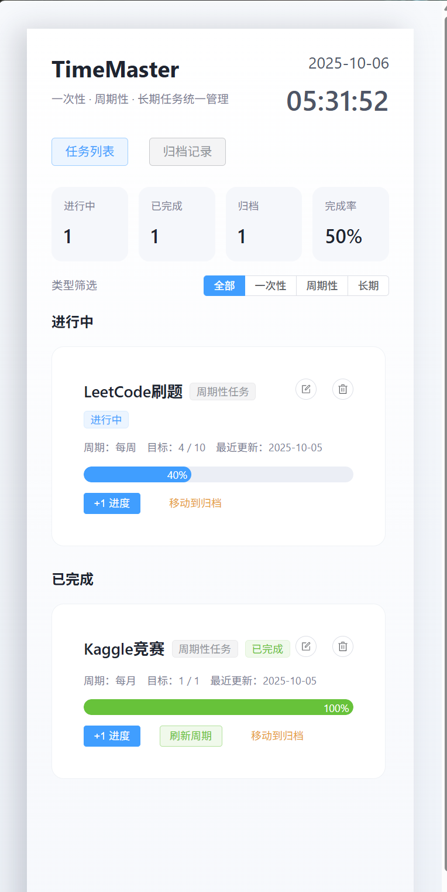
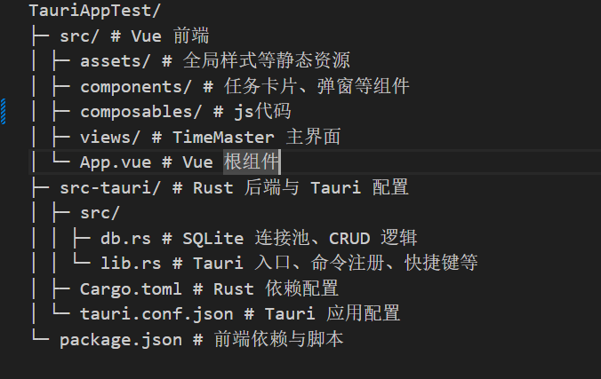

# TimeMaster

TimeMaster 是一款基于 **Tauri + Vue 3 + Rust** 构建的轻量级桌面任务管理工具（TODO），定位为「桌面右侧贴边」的快速看板，非常轻量，运行起来最高20MB，支持一次性 / 周期性 / 长期任务的统一管理、进度追踪，支持`Alt + Q` 随时呼出或隐藏主面板。

---

---

## 项目结构


## 本地部署
#### 使用环境
- Node.js ≥ 18
- Rust ≥ 1.72
- WebView2 （都是Tauri的前提）

```bash
npm install
npm run tauri dev
```

#### 打包安装程序

```bash
npm run tauri build
```
打包好的程序在src-tauri/target/release/bundle中

